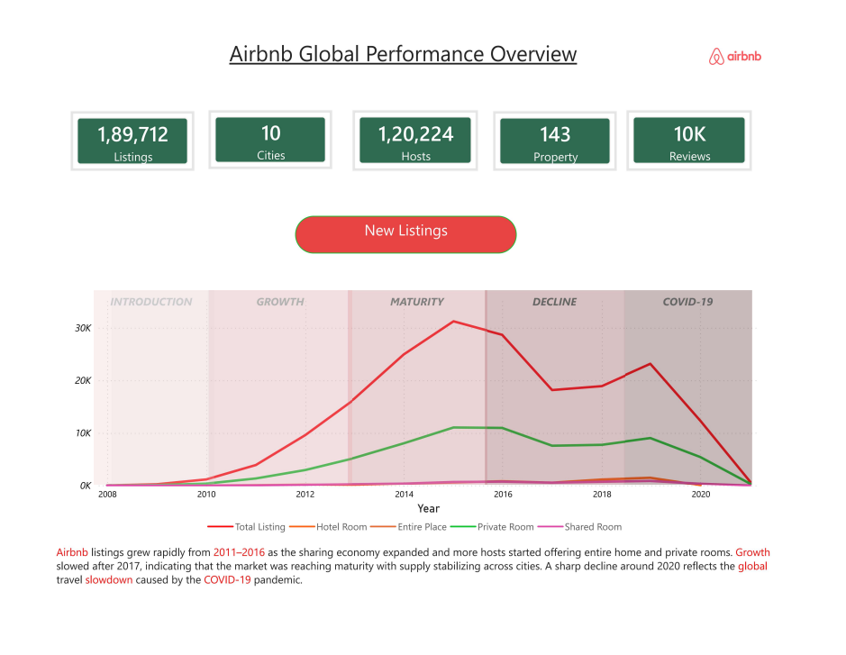
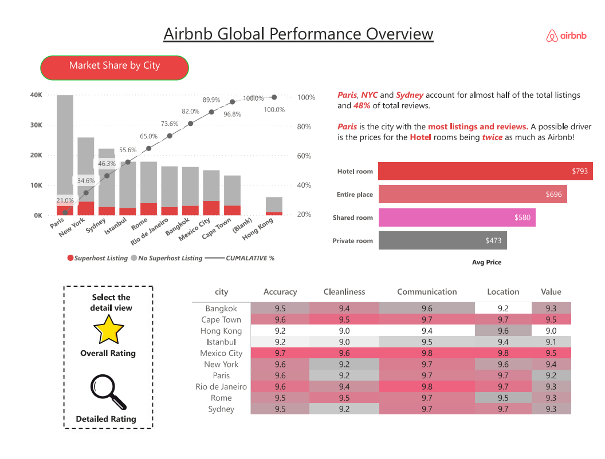
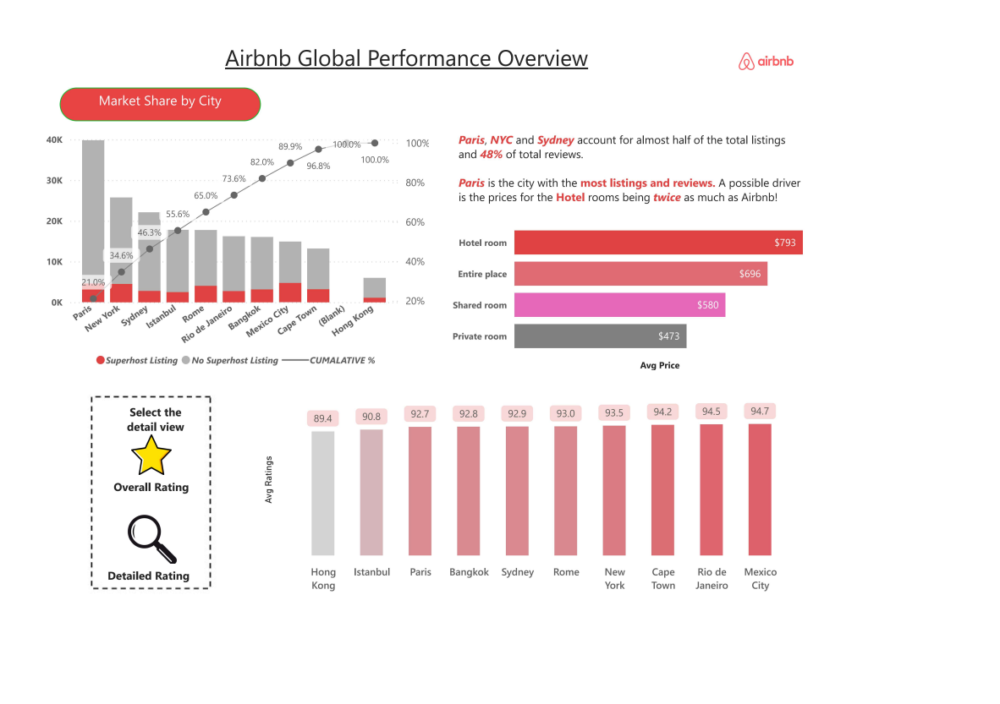

# 🏠 Airbnb Global Performance Dashboard

> Power BI dashboard analyzing Airbnb's performance across **10 cities · 1,89,712 listings · 2008–2020**


---

## 📖 About

This project explores Airbnb's marketplace health across 10 major global cities using 12 years of listing and review data. The dashboard was built to answer real business questions — which cities dominate supply, how pricing varies by room type, where host quality is weakest, and how severely COVID-19 disrupted listing growth. It is structured across 3 report pages and powered by 18 custom DAX measures covering listings, pricing, review sub-scores, host segmentation, and cumulative city-level ranking.

---

## 🛠 Tech Stack

| Tool | Usage |
|------|-------|
| **Power BI Desktop** | Dashboard design, data modelling, report pages |
| **Power Query (M)** | Data cleaning, type casting, column standardisation |
| **DAX** | 18  measures — counts, rankings, averages, cumulative logic |
| **CSV (flat files)** | Data ingestion from Inside Airbnb |

---

## 🗂 Data Source

**Source:** [Inside Airbnb](http://insideairbnb.com/) — publicly available dataset

| File | Description |
|------|-------------|
| `listings.csv` |  price, room type, host info, availability, review scores |
| `reviews.csv` | Review-level data — reviewer ID, date, listing ID |
| `Listings_data_dictionary.csv` | Column definitions for listings |
| `Reviews_data_dictionary.csv` | Column definitions for reviews |

**Cities:** Paris · New York · Sydney · Istanbul · Rome · Rio de Janeiro · Bangkok · Mexico City · Cape Town · Hong Kong
**Period:** 2008 – 2020

---

## 📌 Business Problem

Airbnb operates across fragmented global markets with limited visibility into cross-city performance. This project addresses:

- No unified pricing benchmark across cities and room types
- Inability to identify which markets are superhost-dense vs quality-deficient
- Lack of a cumulative market share view to prioritize city-level investment
- No structured way to track how COVID-19 impacted listing supply over time
- Guest experience scores (accuracy, cleanliness, communication) tracked in silos with no composite view

---

## 📸 Dashboard Preview


### Global Overview — Growth & COVID Impact



### Overall Performance



### Detailed City & Ratings View


---

## 📊 Dashboard Pages

| Page | Focus |
|------|-------|
| **Global Overview** | Total listings, market share by city, avg price by room type, superhost vs non-superhost |
| **Detailed Ratings** | Per-city review sub-scores — accuracy, cleanliness, communication, location, value |
| **Growth & COVID Impact** | New listing trends 2008–2020 across introduction → growth → maturity → decline → COVID-19 phases |

---

## 💡 Key Insights

- **Paris, NYC & Sydney** account for almost half of all listings and **48% of total reviews**
- **Paris leads in both listings and reviews** — hotel rooms there are priced at **$793/night**, nearly twice the Airbnb average
- **Hotel rooms ($793) are the most expensive** room type globally, followed by entire place ($696), shared room ($580), and private room ($473)
- **Mexico City (94.7) and Rio de Janeiro (94.5)** are the highest-rated cities; **Hong Kong (89.4) and Istanbul (90.8)** are the lowest
- Listings grew rapidly from **2011–2016**, plateaued through maturity (2016–2018), then sharply declined in 2020 due to **COVID-19**
- **1,20,224 unique hosts** manage listings across 10 cities with only **143 property types** in use
- The cumulative % curve shows **top 3 cities (Paris, NYC, Sydney) control ~46% of supply** — high concentration risk

---

## ✅ Recommendations

1. **Diversify supply into lower-ranked cities** — Cape Town, Hong Kong and Bangkok have room to grow with less competition
2. **Investigate Paris hotel room pricing** — at $793/night they are twice the platform average, potentially pricing out guests
3. **Target quality improvement in Hong Kong & Istanbul** — both sit below 91 in avg ratings, the weakest in the dataset
4. **Build a post-COVID recovery playbook** — the 2020 decline is severe across all room types; entire place listings dropped the hardest
5. **Use the cumulative % view to rebalance host acquisition** — over-indexing on top 3 cities creates systemic supply risk

---

## 🧮 DAX Measures

### 📦 Listing Counts

```dax
-- Total unique listings
Total Listings ID = DISTINCTCOUNT(Listings[listing_id])

-- By room type
Entire Place   = CALCULATE(COUNT(Listings[listing_id]), Listings[room_type] = "Entire Room")
Hotel Room     = CALCULATE(COUNT(Listings[listing_id]), Listings[room_type] = "Hotel Room")
Room           = CALCULATE(COUNT(Listings[listing_id]), Listings[room_type] = "Private Room")
Shared Room    = CALCULATE(COUNT(Listings[listing_id]), Listings[room_type] = "Shared Room")

-- By host type
Superhost Listing    = CALCULATE(COUNT(Listings[listing_id]), Listings[host_is_superhost] = "t")
No Superhost Listing = CALCULATE(COUNT(Listings[listing_id]), Listings[host_is_superhost] = "f")
```

### 📈 City Ranking & Cumulative Analysis

```dax
-- Rank cities by total listing count (descending)
City Rank = RANKX(ALL(Listings[city]), [Total Listings],, DESC)

-- Running total of listings up to current rank
Cumulative Listings =
VAR CurrentRank = MAXX(VALUES(Listings[city]), [City Rank])
RETURN
    CALCULATE(
        [Total Listings],
        FILTER(ALL(Listings[city]), [City Rank] <= CurrentRank)
    )

-- Cumulative % share of total listings (Pareto/80-20 analysis)
Cumulative % =
DIVIDE(
    [Cumulative Listings],
    CALCULATE([Total Listings], ALL(Listings[city]))
)
```

### 💰 Pricing

```dax
Avg Price = AVERAGE(Listings[price])
```

### ⭐ Review & Rating Scores

```dax
Avg Ratings      = AVERAGE(Listings[review_scores_rating])
Accuracy         = AVERAGE(Listings[review_scores_accuracy])
Cleanliness      = AVERAGE(Listings[review_scores_cleanliness])
Communication    = AVERAGE(Listings[review_scores_communication])
Location         = AVERAGE(Listings[review_scores_location])
Value for Money  = AVERAGE(Listings[review_scores_value])

-- Avg reviews written per unique reviewer (engagement depth)
Reviews per Reviewer =
CALCULATE(
    COUNT(Reviews[review_id]),
    ALLEXCEPT(Reviews, Reviews[reviewer_id])
)
```

---

## 📂 Repository Structure

- **airbnb_26sumitm.pbix** — Main Power BI dashboard file
- **listings.csv** — Primary dataset (1,89,712 listings)
- **reviews.csv** — Review-level dataset
- **Data dictionaries** — Column descriptions for listings & reviews
- **Dashboard PDFs** — Static exports for quick preview

---

##  ▶️ View the Dashboard

- Open the `.pbix` file using Power BI Desktop  
- Or view the dashboard using the PDF files in this repository  

---

**Sumit Tiwari** · [GitHub](https://github.com/sumittiwari-7)
